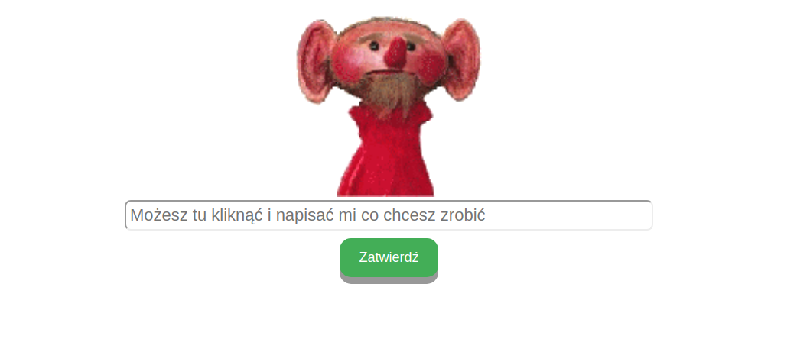

# chatbot-browser
Basic computer utilities managed by our custom agent 
created with [Google DialogFlow](https://dialogflow.com/)
as an interface for older adults.



The application currently (27.01.2019) can be accessed at:
https://jovialallen.pythonanywhere.com/

# Description
Application using google SDK to communicate with a DialogFlow agent.
The agent's purpose is to assist older adults navigate through basic,
yet most useful for them utilities of modern computers, namely:
* Mailbox
* Weather status and forecast
* Top press news
* Online voice and video communicator (Google hangouts)
* Web search utility

## How to run locally

1. Build a Docker image:
`make build`

2. Start the application:
`make start_app`

You can also work in the development environment: 
`make dev`

### Additional requirements
#### DialogFlow SDK
* Application requires Google Application Credentials.
* The DialogFlow agent (included id this repo: [agent.zip](agent.zip))

The agent can be imported to DialogFlow system on your own account.
It allows you to generate required credentials' file.  
All google services can be managed from Google Cloud Platform console.
Here are details regarding the authentication:
https://cloud.google.com/docs/authentication/getting-started 

#### Weather Data
* Application uses https://openweathermap.org/api for weather data,
API key is required.

Both, the path to the Google Application Credentials file
and weather API key should be available as environmental variables,
named `GOOGLE_APPLICATION_CREDENTIALS` and `weather_api_key` accordingly.

# Sample data obtained with DialogFlow
## Sample POST request from DialogFlow (integration with a webhook)
```
{'originalDetectIntentRequest': {'payload': {}},
 'queryResult': {'allRequiredParamsPresent': True,
  'fulfillmentMessages': [{'text': {'text': ['Rozumiem, otwieram skrzynkę mailową']}}],
  'fulfillmentText': 'Rozumiem, otwieram skrzynkę mailową',
  'intent': {'displayName': 'start-action',
   'name': 'projects/test-agent-fb700/agent/intents/f4d7ee12-9b61-432e-8213-fe57ad957304'},
  'intentDetectionConfidence': 0.55,
  'languageCode': 'pl',
  'parameters': {'functions': 'mail'},
  'queryText': 'wiadomość'},
 'responseId': '2e6d5598-9924-4bf9-b7f7-58b96f0346dc',
 'session': 'projects/test-agent-fb700/agent/sessions/e9bd71e4-efa7-6296-9796-0ef70d7f4785'}
```

### Note
It's recommended by google but it's very limited and probably shouldn't be
used for use cases when we want to process output from an agent by ourselves
and present it to only the specific user who interacted with the agent.
However, here is an example of a project based on that architecture:
https://medium.com/swlh/how-to-build-a-chatbot-with-dialog-flow-chapter-4-external-api-for-fulfilment-3ab934fd7a00

## DialogFlow API response for not recognized
```buildoutcfg
query_result {
  query_text: "feature learning"
  action: "input.unknown"
  parameters {
  }
  all_required_params_present: true
  fulfillment_text: "Możesz to powtórzyć?"
  fulfillment_messages {
    text {
      text: "Nie bardzo rozumiem."
    }
  }
  intent {
    name: "projects/test-agent-fb700/agent/intents/745f123c-c680-42fc-81d9-244352324cc7"
    display_name: "Default Fallback Intent"
    is_fallback: true
  }
  intent_detection_confidence: 1.0
  language_code: "pl"
}
```

## DialogFlow API response for recognized
```
query_result {
  query_text: "wiadomość"
  parameters {
    fields {
      key: "functions"
      value {
        string_value: "mail"
      }
    }
  }
  all_required_params_present: true
  fulfillment_text: "Rozumiem, otwieram skrzynkę mailową"
  fulfillment_messages {
    text {
      text: "Rozumiem, otwieram skrzynkę mailową"
    }
  }
  intent {
    name: "projects/test-agent-fb700/agent/intents/f4d7ee12-9b61-432e-8213-fe57ad957304"
    display_name: "start-action"
  }
  intent_detection_confidence: 0.550000011920929
  diagnostic_info {
    fields {
      key: "webhook_latency_ms"
      value {
        number_value: 128.0
      }
    }
  }
  language_code: "pl"
}
webhook_status {
  code: 3
  message: "Webhook call failed. Error: Failed to parse webhook JSON response: Cannot find field: success in message google.cloud.dialogflow.v2beta1.WebhookResponse."
}
```